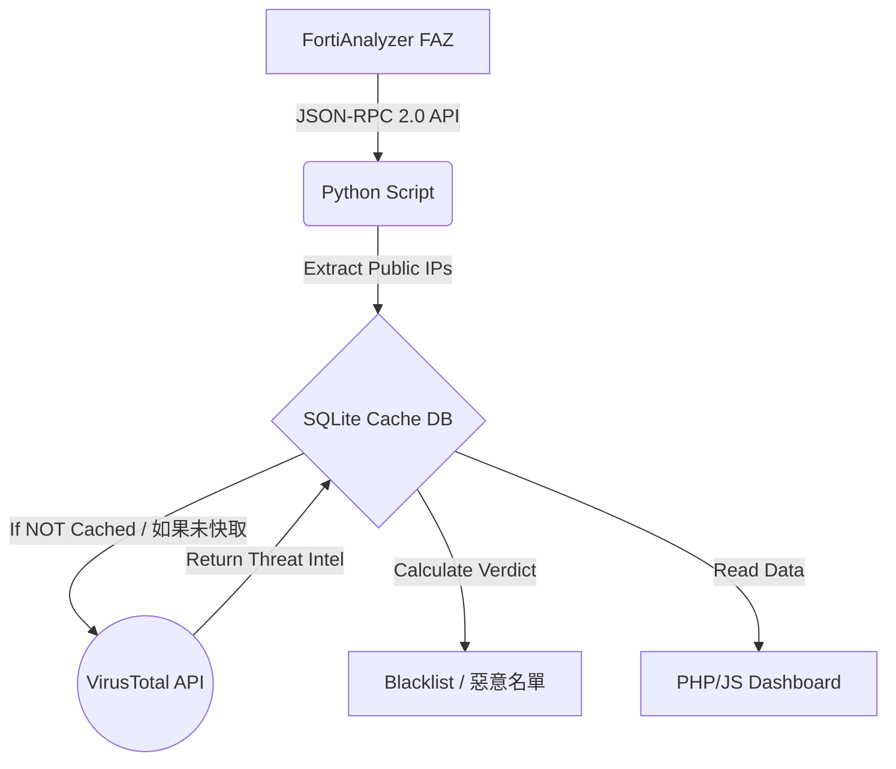

# Block_IP Security Automation Dashboard
## Technical Presentation / 技術簡報
**Target Audience:** IT Team / 針對 IT 團隊

---

## Slide 1: Introduction / 專案簡介
**Title:** Automated Threat Intelligence & IP Blocking / 自動化威脅情資與 IP 阻擋系統
*   **Purpose (目的):** Automate the analysis of SSLVPN failed logins from FortiAnalyzer (FAZ) and correlate them with VirusTotal's threat intelligence to identify and block malicious attackers. 自動分析 FAZ 上的 SSLVPN 登入失敗日誌，並結合 VirusTotal 的威脅情資來識別並阻擋惡意攻擊者。
*   **Key Components (核心組件):** 
    *   Python Backend (API Integration, Data Processing / API 整合與數據處理)
    *   SQLite Database (Local Caching & Aggregation / 本地快取與數據聚合)
    *   PHP/HTML/JS Dashboard (Data Visualization / 資料視覺化)

---

## Slide 2: Analysis Workflow / 分析流程架構
*(Recommendation: Include a flowchart diagram on this slide / 建議在此投影片放上流程圖)*



*   **Workflow (工作流程):**
    1.  Fetch raw logs from FAZ / 從 FAZ 獲取原始日誌。
    2.  Filter private IPs, extract target public IPs / 過濾私有 IP，提取目標公網 IP。
    3.  Check local SQLite Cache first to save API quota / 優先查詢本地 SQLite 快取以節省 VT API 配額。
    4.  If cache miss, query VirusTotal API v3 / 若快取未命中，則查詢 VirusTotal API v3。
    5.  Classify as Malicious, Suspicious, or Clean based on vendor flags / 根據防毒引擎標記數量分類為惡意、可疑或乾淨。
    6.  Display results instantly on the Web Dashboard / 在網頁儀表板上即時顯示分析結果。

---

## Slide 3: Querying FAZ Logs via API / 透過 API 查詢 FAZ 日誌
**Technical Details (技術細節):**
*   **Protocol:** Fortinet JSON-RPC 2.0 API
*   **Authentication:** Bearer Token (Secure, no passwords in script / 安全，腳本中不包含密碼)
*   **Method (調用方法):** `exec/logview/adom/root/logsearch`
*   **Asynchronous Process (非同步處理):**
    1.  Send search query (e.g., `subtype == vpn && action == ssl-login-fail`). / 發送搜尋查詢。
    2.  FAZ returns a Task ID (`tid`). / FAZ 回傳任務 ID。
    3.  Python continuously polls FAZ for chunks of logs using the `tid` until 100% complete. / Python 使用 Task ID 持續向 FAZ 輪詢抓取日誌片段，直到進度 100%。

---

## Slide 4: Querying VirusTotal via API / 透過 API 查詢 VirusTotal
**Technical Details (技術細節):**
*   **Protocol:** REST API (JSON)
*   **Version:** VirusTotal API v3
*   **Endpoint:** `https://www.virustotal.com/api/v3/ip_addresses/{ip}`
*   **Key Techniques (關鍵技術):**
    *   **Rate Limiting Resilience (速率限制處理):** Implemented `time.sleep()` to handle HTTP 429 Too Many Requests errors automatically. / 實作 `time.sleep()` 來自動處理 HTTP 429 請求過多錯誤。
    *   **3-Tier Cache System (三層快取架構):** 
        1. Permanent Blacklist (known bad / 已知惡意名單, 30-day TTL).
        2. General Cache (short-term / 短期快取, 7-day TTL).
        3. Live API Fetch.
        *Result:* Saves >90% of API calls. / *結果*：節省超過 90% 的 API 呼叫次數。

---

## Slide 5: Technical Limitations / 技術限制
1.  **FAZ API Ceiling (FAZ API 最高上限):** 
    *   *Issue:* A single FAZ search task refuses to return more than exactly 75,000 logs in one query to protect FAZ memory limits. / *問題*：為保護 FAZ 記憶體，單次搜尋任務最多只能回傳精確的 75,000 筆日誌。
    *   *Solution:* Implemented hourly cron jobs in Windows Task Scheduler. By fetching small deltas every hour, we permanently bypass the 75k ceiling. / *解決方案*：在 Windows 工作排程器實作每小時自動化任務。透過每小時抓取少量增量資料，永久避開 75k 上限。
2.  **VirusTotal API Throttle (VT API 速率限制):** 
    *   *Issue:* Free API keys are strictly limited to 4 requests/minute. / *問題*：免費 API 金鑰嚴格限制每分鐘 4 次請求。
    *   *Solution:* Aggressive SQLite caching mitigates this, but bulk initial scans can take minutes to clear. / *解決方案*：積極的 SQLite 快取機制可緩解此問題，但首次大規模掃描可能需要幾分鐘才能完成。

---

## Slide 6: Next Steps & Scaling Out / 下一步與橫向擴展建議
**Recommendation: Scaling to Multiple FortiGates / 建議：擴展至多台 FortiGate 設備**

How do we support a 2nd, 3rd, or 10th FortiGate? / 如何支援第二台、第三台或第十台 FortiGate？

1.  **Single Pane of Glass (單一集中管理面):**
    *   Because FAZ centralizes logs for all FortiGates, we do **not** need to query individual firewalls. / 因為 FAZ 集中管理了所有 FortiGate 的日誌，我們**不需要**單獨查詢每台防火牆。
2.  **Required Code Changes (必要的程式碼修改):**
    *   Update the FAZ search filter from `subtype == vpn` to group by `devid` (Device ID) or `vd` (VDOM). / 更新 FAZ 搜尋過濾器，依照 `devid` (設備 ID) 或 `vd` (虛擬網域) 進行分組。
    *   **DB Schema Change:** Add a `source_device` column to `faz_raw_events` table in SQLite. / **資料庫結構變更**：在 SQLite 的 `faz_raw_events` 資料表中新增 `source_device` 欄位。
3.  **UI Enhancements (介面增強):**
    *   Add a dropdown filter in the PHP Dashboard to select specific FortiGate devices. / 在 PHP 儀表板中添加下拉式選單，以過濾特定的 FortiGate 設備。
4.  **Auto-Blocking Implementation (實作自動阻擋 - The Ultimate Goal):**
    *   Use the generated Malicious IPs list and push it back to the FortiGates via Fortinet Fabric Connectors (External Dynamic Block List) or direct REST API calls. / 將生成的惡意 IP 名單，透過 Fortinet Fabric Connectors (外部動態阻擋清單) 或直接使用 REST API 推送回 FortiGate 設備自動阻擋。

---

## Appendix A: Querying FortiAnalyzer API (Python Example) / 附錄 A：查詢 FAZ API 程式碼範例

```python
import requests
import time

FAZ_URL = "https://<faz_ip>/jsonrpc"
HEADERS = {"Authorization": "Bearer <YOUR_BEARER_TOKEN>"}

def search_faz_logs():
    # 1. Start the search task / 啟動搜尋任務
    payload = {
        "id": 1,
        "jsonrpc": "2.0",
        "method": "exec",
        "params": [{
            "url": "/logview/adom/root/logsearch",
            "filter": "subtype == vpn && action == ssl-login-fail"
        }]
    }
    
    response = requests.post(FAZ_URL, json=payload, headers=HEADERS, verify=False)
    task_id = response.json().get('result', {}).get('tid')
    
    # 2. Continually Poll for results using the Task ID / 使用任務 ID 持續輪詢抓取結果
    all_logs = []
    
    for attempt in range(100):
        time.sleep(2)
        poll_payload = {
            "id": 2, "jsonrpc": "2.0", "method": "get",
            "params": [{"url": f"/logview/adom/root/logsearch/{task_id}", "limit": 500, "offset": len(all_logs)}]
        }
        r2 = requests.post(FAZ_URL, json=poll_payload, headers=HEADERS, verify=False).json()
        
        data = r2.get("result", {}).get("data", [])
        all_logs.extend(data)
        
        pct = r2.get("result", {}).get("percentage", 0)
        if pct >= 100:
            break
            
    return all_logs
```

---

## Appendix B: Querying VirusTotal API (Python Example) / 附錄 B：查詢 VirusTotal API 程式碼範例

```python
import requests
import time

VT_API_KEY = "YOUR_VIRUSTOTAL_API_KEY"
HEADERS = {"x-apikey": VT_API_KEY}

def classify_ip_virustotal(ip_address):
    url = f"https://www.virustotal.com/api/v3/ip_addresses/{ip_address}"
    
    try:
        response = requests.get(url, headers=HEADERS, timeout=10)
        
        # Handle Rate Limiting (4 per min) / 處理免費版速率限制 (每分鐘 4 次)
        if response.status_code == 429:
            print("[Warning] Rate limit hit. Waiting 60s...")
            time.sleep(60)
            response = requests.get(url, headers=HEADERS, timeout=10)
            
        data = response.json()['data']['attributes']
        stats = data['last_analysis_stats']
        
        malicious_count = stats.get('malicious', 0)
        
        print(f"IP: {ip_address} | Malicious Flags: {malicious_count}")
        return malicious_count
        
    except Exception as e:
        print(f"Error querying VT: {e}")
        return None
```
