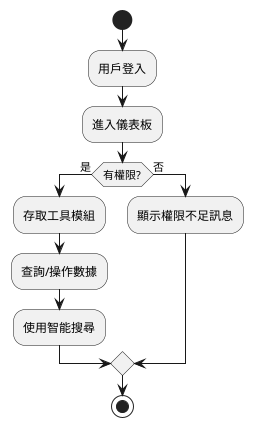
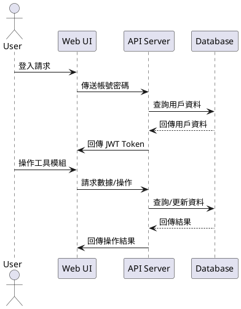
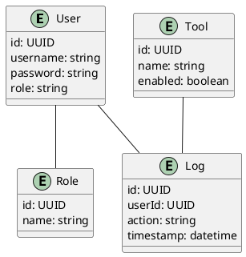

# Cacti 專案規格文件

## 一、專案流程說明
1. 使用 PowerShell 指令初始化專案架構（禁止手動建立目錄）。
2. 撰寫與維護規格文件（spec.md）、任務清單（todolist.md）、進度報告（report.md）。
3. 依據規格文件開發各功能模組，撰寫詳細函式註解。
4. 每個功能模組開發完成後，實施自動化單元測試，確保測試覆蓋率與規格一致。
5. 測試通過後，於 report.md 記錄進度，並即時反映於 todolist.md。
6. 專案完成後，撰寫 README.md，包含安裝、執行、測試教學與設計思路。

## 二、功能模組詳細規格

### 1. 儀表板總覽（Dashboard）
- 顯示關鍵業務指標（如任務進度、資源分配、數據分析等）
- 支援自定義數據視覺化圖表
- 提供業務趨勢分析與預警提醒

### 2. 工具模組管理（Tools Management）
- 工具註冊、分類與管理
- 模組啟用/停用功能
- 權限分配（依部門/用戶）

### 3. 智能數據探索（Smart Data Discovery）
- AI 智能搜尋（生成式 AI 查詢建議）
- 中文自然語言查詢
- 智能報表推薦

### 4. 安全認證系統（Security & Auth）
- JWT Token 認證
- 角色基礎訪問控制（RBAC）
- 操作日誌記錄

### 5. 共用元件與基礎設施
- UI 組件（ShadCN UI）
- 狀態管理（Zustand + React Context API）
- 表單處理（React Hook Form + Zod）
- API 與資料庫（Next.js API Routes + Prisma + SQLite/PostgreSQL）

## 三、UML 圖

### 1. 流程圖（Process Flow）

### 2. 時序圖（Sequence Diagram）

### 3. 關聯圖（Entity Relationship Diagram）

## 四、單元測試規劃

- **覆蓋率目標**：90% 以上
- **測試案例**：
  - 儀表板：指標正確顯示、圖表渲染、預警提醒
  - 工具模組管理：註冊/分類/啟用/停用/權限分配
  - 智能數據探索：AI 查詢建議、自然語言查詢、報表推薦
  - 認證系統：登入、JWT 驗證、RBAC 權限控管、日誌記錄
  - 共用元件：UI 行為、表單驗證、API 輸入/輸出
- **預期行為**：
  - 所有正常與異常情境皆能正確處理
  - 測試通過即視為符合規格
  - 失敗案例需明確報錯並記錄於報告
